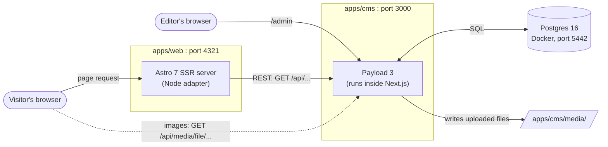
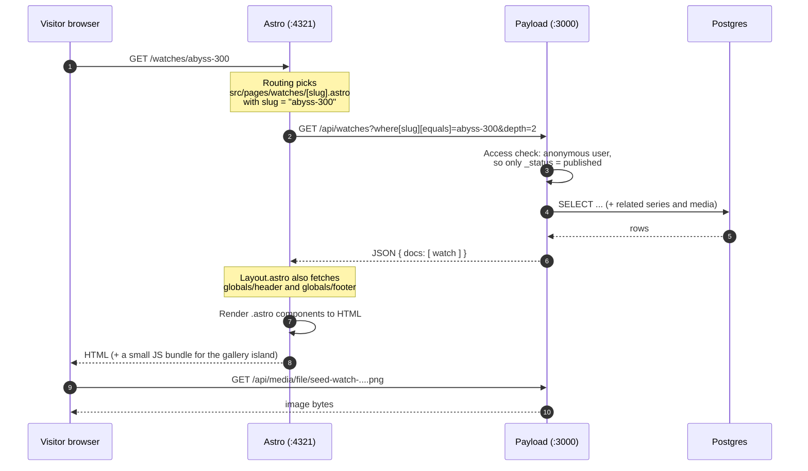

# 1. Architecture overview

## The one-sentence version

Editors write content in **Payload**, which stores it in **Postgres**. When someone visits the website, **Astro** fetches that content from Payload's REST API and renders it to HTML on the server.

## The pieces



| Piece | Where | Job |
| --- | --- | --- |
| **Payload CMS** | `apps/cms`, port 3000 | Defines the content model, stores content, serves the admin UI at `/admin` and the REST API at `/api` |
| **Next.js** | inside `apps/cms` | The web server Payload runs on. Payload 3 is a set of Next.js routes, so the CMS app *is* a Next.js app. We don't build any public pages with Next |
| **Postgres** | Docker container `astro-payload-postgres`, port 5442 | Database for all content, users, versions, and preferences |
| **Media folder** | `apps/cms/media/` | Uploaded image files and their resized versions. Payload serves them at `/api/media/file/<name>` |
| **Astro** | `apps/web`, port 4321 | The public site. Renders every page on request (SSR), using data from Payload |
| **React** | inside `apps/web` | Only for interactive "islands", currently just the watch image gallery |
| **Tailwind v4** | inside `apps/web` | Styling, driven by the tokens in `apps/web/src/styles/global.css` |

## Why two separate apps?

This is a **headless CMS** setup. The CMS manages content and has no opinion about how the site looks. The frontend is free to render that content however it wants.

- **Payload** gives editors an admin UI, drafts, versions, media handling, access control, and a typed API. All of this is generated from a TypeScript config.
- **Astro** is built for content sites. It sends plain HTML by default and only adds JavaScript where you ask for it, so pages are fast.

The cost is that two servers need to talk to each other. Most of these docs explain that connection.

> **Note:** Payload 3 *can* also render the public site itself, using Next.js pages in the same app. This project chose Astro for the frontend instead, so `apps/cms/next.config.ts` simply redirects `/` to `/admin`.

## Life of a page request

This is what happens when a visitor opens `http://localhost:4321/watches/abyss-300`:



Things worth noticing:

1. **Every request is rendered on demand.** Nothing is pre-built. That's what lets drafts and Live Preview work. ([Astro doc](04-astro.md#rendering-mode-ssr))
2. **Astro never touches the database.** It only talks to Payload over HTTP. ([Connection doc](05-payload-astro-connection.md))
3. **Payload decides what the caller may see.** An anonymous request only gets published documents. ([Payload doc](03-payload.md#access-control))
4. **Images come straight from Payload.** The browser loads them from `:3000`, not through Astro.

## Two modes: published vs. preview

The same Astro page works in two modes:

| | Normal visitor | Live Preview (inside the admin) |
| --- | --- | --- |
| URL | `/watches/abyss-300` | `/watches/abyss-300?preview=<PREVIEW_SECRET>` |
| Astro asks Payload for | published version | latest **draft** (`draft=true`) |
| Authenticated as | nobody | the "preview" user, via API key |
| Auto-refresh on edit | no | yes (`LivePreviewListener`) |

See [Live Preview](06-live-preview.md) for the full mechanism.

## Repository layout

```
.
├── apps/
│   ├── cms/                         Payload + Next.js
│   │   ├── src/
│   │   │   ├── payload.config.ts    ← the heart of the CMS
│   │   │   ├── collections/         Pages, Watches, Series, Media, Users
│   │   │   ├── globals/             Header, Footer
│   │   │   ├── blocks/              page-builder blocks (Hero, Gallery, …)
│   │   │   ├── fields/              reusable fields: slugField(), linkField()
│   │   │   ├── access/              access-control functions
│   │   │   ├── utilities/           previewURL(), slugify()
│   │   │   ├── migrations/          SQL migrations for production
│   │   │   ├── seed/                demo content script
│   │   │   ├── app/(payload)/       Next routes generated by Payload (admin + api)
│   │   │   └── payload-types.ts     GENERATED TypeScript types
│   │   ├── media/                   uploaded files (git-ignored)
│   │   └── docker-compose.yml       local Postgres
│   └── web/                         Astro
│       ├── astro.config.mjs         SSR + Node adapter + env schema
│       └── src/
│           ├── pages/               file-based routes
│           ├── layouts/Layout.astro <html>, header, footer, preview listener
│           ├── components/          shared components
│           │   └── blocks/          one component per CMS block
│           ├── lib/                 payload.ts (API client), preview.ts, utils.ts, richText.ts
│           ├── styles/global.css    Tailwind + brand tokens
│           └── payload-types.ts     COPY of the CMS types (via types:sync)
├── scripts/sync-types.mjs           copies the types from cms to web
├── package.json                     root scripts only (not a workspace)
└── docs/                            you are here
```

**Not a monorepo workspace.** Each app has its own `node_modules` and `package-lock.json`. Install packages per app, e.g. `npm --prefix apps/web install some-pkg`. The root `package.json` only holds convenience scripts and `concurrently`.

## Current status and known gaps

- Content and branding are **placeholders** until the client delivers real material.
- Media is stored on local disk. A cloud storage adapter (S3, R2, …) is needed before deploying.
- No production database or host has been chosen yet.
- No email adapter is configured, so password reset emails don't work.

Next: [Running the app →](02-running-locally.md)
