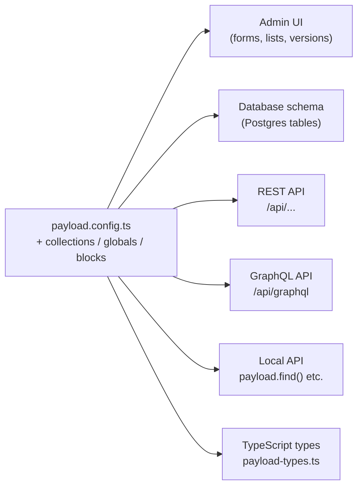
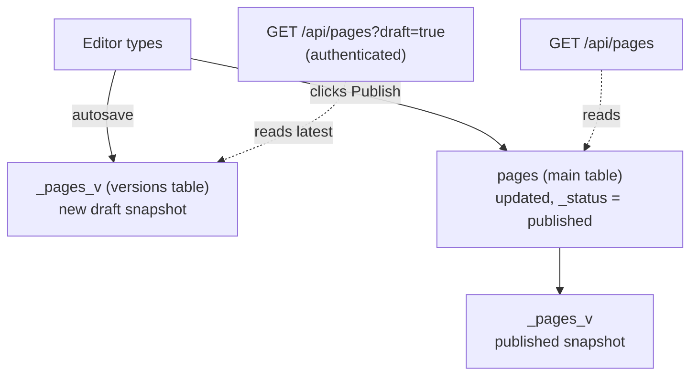
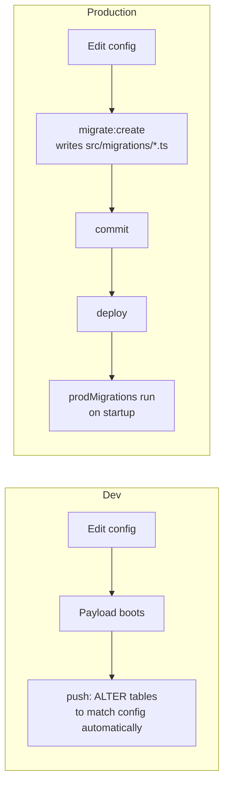

# 3. How Payload works

Payload is a **config-driven, code-first headless CMS**. You describe your content in TypeScript, and Payload generates everything else from that description:



You never hand-build an admin form, write a SQL `CREATE TABLE`, or code a REST endpoint for content. You add a field to the config, and it shows up in all six places.

## Payload runs inside Next.js

Payload 3 isn't a standalone server. It's a library that mounts into a Next.js app. The files in `apps/cms/src/app/(payload)/` are generated by Payload and say "send these routes to Payload":

| Route file | Serves |
| --- | --- |
| `admin/[[...segments]]/page.tsx` | The whole admin UI at `/admin/*` (a React app) |
| `api/[...slug]/route.ts` | The REST API at `/api/*` |
| `api/graphql/route.ts` | GraphQL at `/api/graphql` |
| `layout.tsx` | Admin root layout and server functions |

You don't edit these. The comment at the top of each says so. `next.config.ts` wraps the Next config with `withPayload()` and redirects `/` to `/admin`, because our public site is Astro.

## The config: `apps/cms/src/payload.config.ts`

This is the entry point. A simplified version of ours:

```ts
export default buildConfig({
  serverURL: 'http://localhost:3000',
  admin: { user: 'users', livePreview: { breakpoints: [...] } },
  collections: [Pages, Watches, Series, Media, Users],
  globals: [Header, Footer],
  cors: [WEB_URL],               // browser origins allowed to call the API
  csrf: [WEB_URL],               // origins allowed to use cookie auth
  editor: lexicalEditor(),       // rich text editor
  secret: process.env.PAYLOAD_SECRET,
  db: postgresAdapter({ pool: { connectionString: DATABASE_URL }, prodMigrations: migrations }),
  sharp,                         // image resizing
  typescript: { outputFile: 'payload-types.ts' },
})
```

## Core concepts

### Collections: many documents of one type

A **collection** is like a database table with an admin screen and an API. Each document has an `id`, `createdAt`, and `updatedAt`.

We have: `pages`, `watches`, `series`, `media`, `users`. See `apps/cms/src/collections/`.

```ts
export const Series: CollectionConfig = {
  slug: 'series',                               // → table "series", API /api/series
  admin: { useAsTitle: 'name' },                // which field labels a doc in the admin
  access: { read: anyone, create: authenticated, ... },
  fields: [
    { name: 'name', type: 'text', required: true },
    slugField('name'),
    { name: 'tagline', type: 'text' },
    { name: 'heroImage', type: 'upload', relationTo: 'media' },
  ],
}
```

### Globals: exactly one document

A **global** is a single document with no list view, for things like site-wide settings. We have `header` (logo, nav) and `footer` (columns, social links). API: `GET /api/globals/header`.

### Fields

Fields define the shape of a document. Each field type maps to an admin input, a DB column (or table), and a TS type. The ones this project uses:

| Field type | Stores | Example here |
| --- | --- | --- |
| `text`, `textarea`, `number`, `checkbox` | a scalar | `Watch.name`, `Watch.price`, `Watch.featured` |
| `select`, `radio` | one of fixed options | `specs.movement`, link `type` |
| `richText` | Lexical JSON (a structured tree, not HTML) | `Watch.description` |
| `upload` | reference to a Media doc | `Series.heroImage` |
| `relationship` | reference to another doc (or many with `hasMany`) | `Watch.series` |
| `array` | a repeating list of sub-fields | `Watch.gallery`, `Header.navItems` |
| `group` | nested object | `linkField()` |
| `blocks` | an ordered list of **different** shapes | `Page.layout` |
| `tabs`, `row` | **layout only**: admin presentation, no data (unless the tab is named) | tabs on Pages and Watches |

A named tab (`{ name: 'specs', ... }`) nests its fields under that key (`watch.specs.movement`). An unnamed tab doesn't (`watch.gallery`).

**Conditional fields**: `admin.condition` shows or hides a field in the admin based on sibling values. For example, `linkField()` only shows `url` when `type === 'custom'`.

### Reusable fields: `apps/cms/src/fields/`

Fields are plain objects, so functions that return field configs keep things consistent:

- **`slugField(source)`**: a unique, indexed `slug` text field. A `beforeValidate` **hook** fills it by slugifying the title or name when left empty.
- **`linkField()`**: a group with `type` (internal page or custom URL), `reference`, `url`, `label`, and `newTab`. The Astro side renders it with `<CMSLink>`.

### Blocks: the page builder

A **blocks** field holds an ordered list where each item can be a different "block" type. Editors pick blocks from a menu and drag them into order. That's our page builder.

```ts
// apps/cms/src/blocks/Hero.ts
export const Hero: Block = {
  slug: 'hero',                 // stored as blockType: 'hero'
  interfaceName: 'HeroBlock',   // name of the generated TS interface
  fields: [ { name: 'heading', type: 'text', required: true }, ... ],
}

// apps/cms/src/collections/Pages.ts
{ name: 'layout', type: 'blocks', blocks: pageBlocks }
```

A page's data then looks like:

```json
{
  "title": "Home",
  "layout": [
    { "blockType": "hero", "heading": "Time, refined.", "image": { "id": 1, "url": "..." } },
    { "blockType": "featuredWatches", "source": "featured", "limit": 3 }
  ]
}
```

Astro uses `blockType` to choose which component renders each item. See [connection doc](05-payload-astro-connection.md#4-rendering-blocks).

### Uploads: the Media collection

A collection with `upload: {...}` becomes an upload collection. Each document is a file plus metadata.

```ts
upload: {
  focalPoint: true,                         // editors click the important point of the image
  imageSizes: [
    { name: 'thumbnail', width: 400, height: 400 },
    { name: 'card', width: 800, height: 1000 },
    { name: 'hero', width: 1920 },
  ],
  mimeTypes: ['image/*'],
}
```

On upload, `sharp` creates each size. The files go to `apps/cms/media/` and are served at `/api/media/file/<filename>`. The document includes `url`, `width`, `height`, `focalX`, `focalY`, and `sizes.card.url` etc.

### Access control

Every collection operation (`create`, `read`, `update`, `delete`) runs an **access function**. It can return:

- `true` or `false`: allow or deny everything, or
- a **query constraint**: allow only documents matching it. Payload adds it to the DB query as an extra `WHERE`.

Ours, in `apps/cms/src/access/index.ts`:

```ts
export const anyone: Access = () => true
export const authenticated: Access = ({ req: { user } }) => Boolean(user)

export const publishedOrAuthenticated: Access = ({ req: { user } }) => {
  if (user) return true                          // logged in: see everything, drafts included
  return { _status: { equals: 'published' } }    // public: only published docs
}
```

| Collection | read | write |
| --- | --- | --- |
| Pages, Watches (drafts) | `publishedOrAuthenticated` | `authenticated` |
| Series, Media, Header, Footer | `anyone` | `authenticated` |
| Users | Payload default (logged-in only) | Payload default |

This is why the public site can't see drafts even if someone adds `?draft=true` to an API URL. Without a user, the access function still restricts results to published documents.

> The **Local API** (`payload.find()` etc., used by the seed) **skips access control by default** (`overrideAccess: true`). It's trusted server code. REST and GraphQL always enforce it.

### Authentication

`Users` has `auth: { useAPIKey: true }`, which makes it an auth collection. Payload adds email, password hashing, login/logout endpoints, and optional API keys. There are two ways to be "a user" when calling the API:

| Method | Used by | How |
| --- | --- | --- |
| **JWT cookie** (`payload-token`) | Editors in the admin | Set by `POST /api/users/login`. The browser sends it automatically |
| **API key** | Astro, for reading drafts | Header `Authorization: users API-Key <key>` (`users` = the collection slug) |

The seed creates `preview@example.com` with API key = `PREVIEW_API_KEY`. Astro sends that key only in preview mode.

> If the API key is wrong, Payload **doesn't** return an error. It treats the request as anonymous, so you silently get published content only.

### Hooks

Hooks are functions that run at points in a document's lifecycle: `beforeValidate`, `beforeChange`, `afterChange`, `afterRead`, `beforeDelete`, and others. They can sit on a collection or on a single field. We use one: `slugField`'s `beforeValidate` hook generates the slug. A common future use is an `afterChange` hook that tells a cache or CDN to purge a page when it's published.

## Drafts, versions, and autosave

Pages and Watches have:

```ts
versions: {
  drafts: { autosave: { interval: 375 } },   // autosave 375 ms after typing stops
  maxPerDoc: 50,                              // keep the last 50 versions
}
```

This adds a `_status` field (`draft` | `published`) and a **versions table** that stores a snapshot per save.



- **Saving a draft** (or autosave) writes a new version. It **doesn't** change what the public sees. The main document stays at the last published state.
- **Publishing** updates the main document and records a version.
- **`?draft=true`** asks for the newest version, draft or not. Combined with an authenticated user, this is how Live Preview shows unpublished edits.
- The admin's **Versions** tab lets editors compare and restore old versions.

Series, Media, and the globals have no drafts. Saving them publishes immediately.

## The database

We use `@payloadcms/db-postgres`, which uses the Drizzle ORM internally. Payload turns the config into tables:

| Config | Tables (examples) |
| --- | --- |
| collection `watches` | `watches` |
| its `gallery` array | `watches_gallery` (one row per item, `_parent_id`, `_order`) |
| drafts on `watches` | `_watches_v`, `_watches_v_version_gallery` |
| `pages.layout` hero block | `pages_blocks_hero`, its `cta` array: `pages_blocks_hero_cta` |
| relationships / uploads | `*_rels` tables or `*_id` columns |
| internal | `payload_migrations`, `payload_preferences`, `payload_locked_documents` |

Postgres limits identifiers to 63 characters, so keep block and field slugs short. Nested names add up fast (`_pages_v_blocks_image_with_text_...`).

### Push (dev) vs. migrations (production)



- **Dev (push):** on boot, Payload syncs the schema directly. Fast, but renaming a field looks like "drop old column, add new one", which **loses data**. If Payload detects data loss it asks for confirmation in the terminal. Hence `< /dev/null` on CLI commands so they can't hang waiting.
- **Production (migrations):** after each schema change, run `npm --prefix apps/cms run payload migrate:create <name>`. This writes a TS file with the `up`/`down` SQL into `src/migrations/` and registers it in `src/migrations/index.ts`. In production, `prodMigrations` applies pending ones at startup and records them in `payload_migrations`.
- **Never mix them.** A DB that has been managed by push shouldn't later be migrated, because the migration history won't match. Production gets its own database.

## Three ways to talk to Payload

| API | Where | Access control | Used here by |
| --- | --- | --- | --- |
| **Local API** `payload.find({ collection, where })` | Same Node process | Skipped by default | The seed script |
| **REST** `GET /api/<collection>?where[...]` | HTTP | Enforced | **Astro** (`lib/payload.ts`) |
| **GraphQL** `/api/graphql` | HTTP | Enforced | Unused |

REST cheat-sheet (all of these work for every collection):

```
GET    /api/watches                         list (paginated: docs, totalDocs, page, ...)
GET    /api/watches/:id                     one by ID
GET    /api/watches?where[slug][equals]=x   filter
GET    /api/watches?sort=-price&limit=10    sort / limit
GET    /api/watches?depth=0                 don't populate relationships (IDs only)
GET    /api/watches?draft=true              latest draft (needs auth to see drafts)
POST   /api/watches                         create
PATCH  /api/watches/:id                     update
DELETE /api/watches/:id                     delete
GET    /api/globals/header                  a global
POST   /api/users/login                     log in, returns { token }
```

Use `curl -g` when trying these, so curl doesn't interpret the `[` `]` in `where`.

### `depth`: populating relationships

Relationship and upload fields store an **ID**. `depth` controls how many levels Payload replaces IDs with the full documents:

```jsonc
// depth=0
{ "name": "Abyss 300", "series": 1 }
// depth=1 or more
{ "name": "Abyss 300", "series": { "id": 1, "name": "Abyss", "heroImage": 7 } }
// depth=2: one level further
{ "name": "Abyss 300", "series": { "id": 1, "name": "Abyss", "heroImage": { "id": 7, "url": "/api/media/file/..." } } }
```

Our Astro client defaults to `depth=2`. Header and Footer use `depth=1`.

## Rich text (Lexical)

`editor: lexicalEditor()` makes every `richText` field use the Lexical editor. The value is stored as a **JSON tree**, not HTML:

```json
{ "root": { "children": [
  { "type": "heading", "tag": "h2", "children": [{ "type": "text", "text": "Overview" }] },
  { "type": "paragraph", "children": [{ "type": "text", "text": "Hello", "format": 1 }] }
]}}
```

The frontend is responsible for turning that into HTML. See [connection doc](05-payload-astro-connection.md#7-rich-text-lexical-json--html). `apps/cms/src/seed/lexical.ts` is a small helper that builds this JSON for seed content.

## Generated types

`npm run types:sync` runs `payload generate:types`. It reads the config and writes `apps/cms/src/payload-types.ts` with an interface per collection, global, and block (`Page`, `Watch`, `HeroBlock`, …), then copies it to the web app. **Never edit it by hand**. Regenerate it.

## Live Preview (admin side)

Collections and globals declare which URL to show in the preview iframe:

```ts
admin: {
  livePreview: { url: ({ data }) => previewURL(pagePath(data?.slug)) },
  preview: (data) => previewURL(pagePath(data?.slug)),  // the "Preview" button (opens a new tab)
}
```

`previewURL()` (`apps/cms/src/utilities/previewURL.ts`) builds `WEB_URL + path + ?preview=PREVIEW_SECRET`. The full flow is in [Live Preview](06-live-preview.md).

## Learning more

- Official docs: https://payloadcms.com/docs
- In-repo reference: `apps/cms/.claude/skills/payload/` (`SKILL.md` and `reference/*.md` cover fields, access, hooks, queries, and adapters in depth).
- The best way to learn is to read `apps/cms/src/collections/Watches.ts`, then open a watch in the admin and match each field to what you see.

Next: [How Astro works →](04-astro.md)
