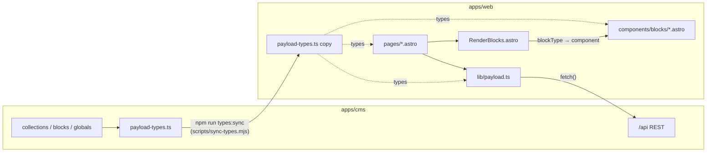
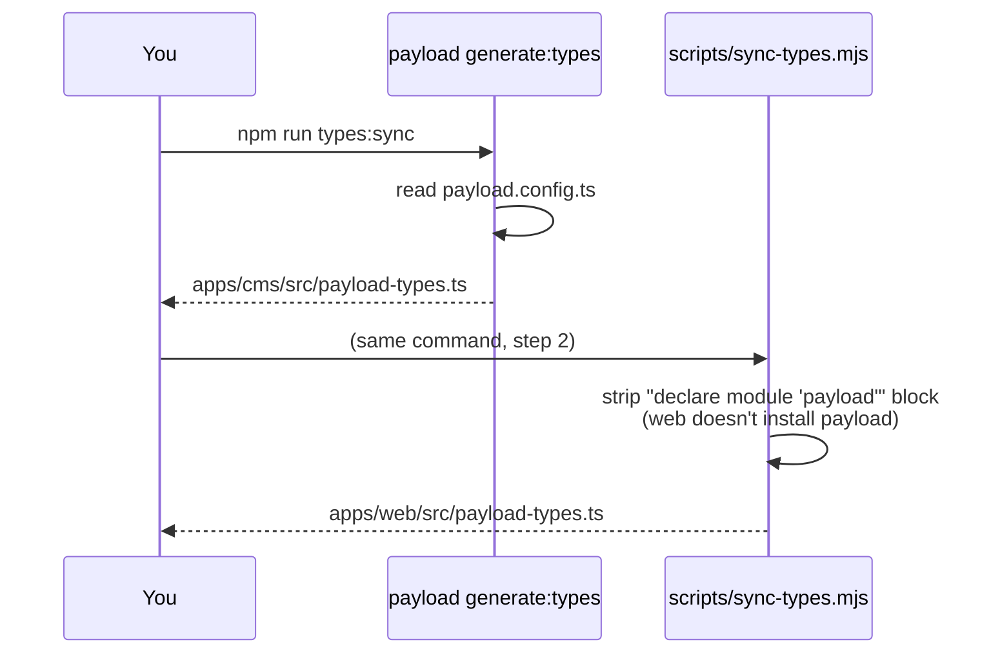

# 5. How Payload and Astro connect

The two apps are joined by four things:

1. **HTTP**: Astro calls Payload's REST API (`apps/web/src/lib/payload.ts`).
2. **Shared types**: Payload's generated TypeScript types are copied into Astro (`npm run types:sync`).
3. **Conventions**: block slugs map to Astro components, and link, media, and rich-text values have matching renderers.
4. **Shared secrets**: `PREVIEW_SECRET` and the preview API key, used for drafts and Live Preview ([doc 6](06-live-preview.md)).



## 1. The REST client: `lib/payload.ts`

Pages never call `fetch` directly. They use typed helpers:

```ts
getPageBySlug(slug, { draft })     // → Page | null
getWatchBySlug(slug, { draft })    // → Watch | null
getSeriesBySlug(slug)              // → Series | null
getWatches({ seriesId?, featured?, limit?, draft })  // → Watch[]
getAllSeries()                     // → Series[]
getHeader({ draft }) / getFooter({ draft })
```

They all go through one `request()` function:

```ts
async function request<T>(path, params = {}, { draft = false, depth = 2 } = {}) {
  const url = new URL(`/api/${path}`, PAYLOAD_URL);
  url.searchParams.set('depth', String(depth));
  // ...add params...
  const headers = {};
  if (draft) {
    url.searchParams.set('draft', 'true');
    if (PAYLOAD_API_KEY) headers.Authorization = `users API-Key ${PAYLOAD_API_KEY}`;
  }
  const res = await fetch(url, { headers });
  if (!res.ok) throw new Error(`Payload request failed: ...`);
  return res.json();
}
```

So `getWatchBySlug('abyss-300', { draft: false })` becomes:

```
GET http://localhost:3000/api/watches?depth=2&limit=1&where[slug][equals]=abyss-300
```

and Payload responds with `{ docs: [ {...watch} ], totalDocs: 1, ... }`. `findOne()` returns `docs[0] ?? null`.

**Rules:**

- Always pass `{ draft: isPreview(Astro.url) }` when fetching draft-enabled content (Pages, Watches), **including fetches inside blocks** like `FeaturedWatches`. Otherwise Live Preview shows stale data for that part.
- A missing document should give a 404: `if (!doc) return Astro.rewrite('/404')`.
- Add new helpers here instead of calling `fetch` in pages. Accept `FetchOptions` so draft mode works.

These requests run **server-to-server** (Astro's Node process to Payload). The visitor's browser never sees the API key, and CORS doesn't apply to them.

## 2. Shared types



After this, Astro code is fully typed against the CMS schema:

```ts
import type { Watch, HeroBlock } from '../payload-types';
type Props = HeroBlock;   // a block component's props = the block's generated interface
```

If you rename a field in the CMS and run `types:sync`, `npm run check` (`astro check`) points to every place in the frontend that breaks. **Run `types:sync` after every collection, global, block, or field change.**

## 3. Relationships: `populated()`

A relationship or upload field is typed as `number | Series`: an ID at `depth=0`, or the full document when populated. Even at `depth=2`, deep nesting or a deleted document can leave a plain ID. `populated()` handles both cases safely:

```ts
export const populated = <T extends object>(value: T | number | null | undefined): T | null =>
  value && typeof value === 'object' ? value : null;

const series = populated(watch.series);   // Series | null
{series && <a href={`/series/${series.slug}`}>{series.name}</a>}
```

## 4. Rendering blocks

A Page's `layout` is an array of blocks, each tagged with `blockType`. `RenderBlocks.astro` looks up a component for each:

```astro
---
const components = {
  hero: Hero,
  richText: RichText,
  featuredWatches: FeaturedWatches,
  imageWithText: ImageWithText,
  seriesGrid: SeriesGrid,
  callToAction: CallToAction,
  gallery: Gallery,
} as const;
---
{blocks?.map((block) => {
  const Component = components[block.blockType];
  return Component ? <Component {...block} /> : null;
})}
```

The key in that map **must equal** the block's `slug` in `apps/cms/src/blocks/<Name>.ts`. A block with no registered component renders nothing. It doesn't crash.

The full chain for `/about`:

```
pages/[...slug].astro
  → getPageBySlug('about')
  → <CMSPage page>              (components/CMSPage.astro)
     → <Layout title/description/image from page.meta>
        → <RenderBlocks blocks={page.layout}>
           → <Hero {...block}> <RichText {...block}> <ImageWithText {...block}> <Gallery {...block}>
```

Blocks can fetch their own data. `FeaturedWatches.astro` calls `getWatches({ featured: true, ... })` when its source is "featured", and `SeriesGrid.astro` loads all series when none are picked.

## 5. Links: `linkField()` ↔ `<CMSLink>`

The CMS `linkField()` stores `{ type, reference, url, label, newTab }`. On the web side:

```ts
linkHref(link)
// type 'reference' → the populated Page → pagePath(slug) → '/' for home, '/<slug>' otherwise
// type 'custom'    → link.url
```

`<CMSLink link={...} appearance="primary|secondary|inline" />` renders the `<a>` with the right `href`, `target`, and styling. Header, Footer, Hero, CallToAction, and ImageWithText all use it.

`pagePath()` exists in both apps (`apps/cms/src/utilities/previewURL.ts` and `apps/web/src/lib/utils.ts`), and the two must agree on how a slug maps to a URL.

## 6. Images: Media ↔ `<Image>` / `mediaUrl()`

Payload returns a Media doc like:

```json
{ "id": 7, "alt": "...", "url": "/api/media/file/seed-hero.png",
  "width": 1600, "height": 1200, "focalX": 50, "focalY": 50,
  "sizes": { "card": { "url": "/api/media/file/seed-hero-800x1000.png", "width": 800, "height": 1000 }, ... } }
```

The `url` is relative to the CMS. `mediaUrl(media, size?)` picks the requested size (falling back to the original) and makes it absolute with `PAYLOAD_URL`. `<Image media size="card" />` renders the `` with width and height, `alt`, lazy loading, and `object-position` set from the editor's **focal point**, so cropped images keep the important part visible.

The browser fetches the image directly from Payload (`:3000`). In production that should become a CDN or object-storage URL once a storage adapter is added.

## 7. Rich text: Lexical JSON → HTML

Payload stores rich text as a Lexical JSON tree. `lib/richText.ts` is a small serializer that walks the tree and outputs HTML for the node types the default editor produces: paragraphs, headings, lists, quotes, links (internal or custom), uploads, line breaks, horizontal rules, and bold, italic, underline, strikethrough, and code text. Text is HTML-escaped.

```astro
<RichText data={watch.description} />
<!-- → <div class="prose ..."><h2>Overview</h2><p>…</p></div> -->
```

If you enable more Lexical features in the CMS (tables, custom blocks inside rich text, etc.), add a matching `case` to `renderNode()`, or the content is rendered as its plain children.

## 8. Globals in the layout

`Layout.astro` fetches Header and Footer on every page:

```ts
const [header, footer] = await Promise.all([getHeader({ draft: preview }), getFooter({ draft: preview })]);
```

So a single page view makes about 3 Payload requests (globals plus the page), sometimes more when blocks fetch extra data. That's fine locally. In production it's a reason to keep Payload close to Astro (same region) and add caching later.

## Where the two apps must agree (checklist)

| Thing | CMS side | Web side |
| --- | --- | --- |
| Block slug | `blocks/<Name>.ts` `slug` | `RenderBlocks.astro` map key |
| Field shapes | collection, block, and global configs | `payload-types.ts` (via `types:sync`) |
| Slug → URL | `utilities/previewURL.ts` `pagePath` | `lib/utils.ts` `pagePath` and the `src/pages/` routes |
| Preview secret | `.env` `PREVIEW_SECRET` | `.env` `PREVIEW_SECRET` |
| Preview API key | `.env` `PREVIEW_API_KEY` (given to the user by the seed) | `.env` `PAYLOAD_API_KEY` |
| Origins | `WEB_URL` (CORS, CSRF, preview URLs) | `PAYLOAD_URL` (API calls, listener origin) |
| Rich text features | `lexicalEditor()` features | `lib/richText.ts` node handlers |

Next: [Live Preview →](06-live-preview.md)
