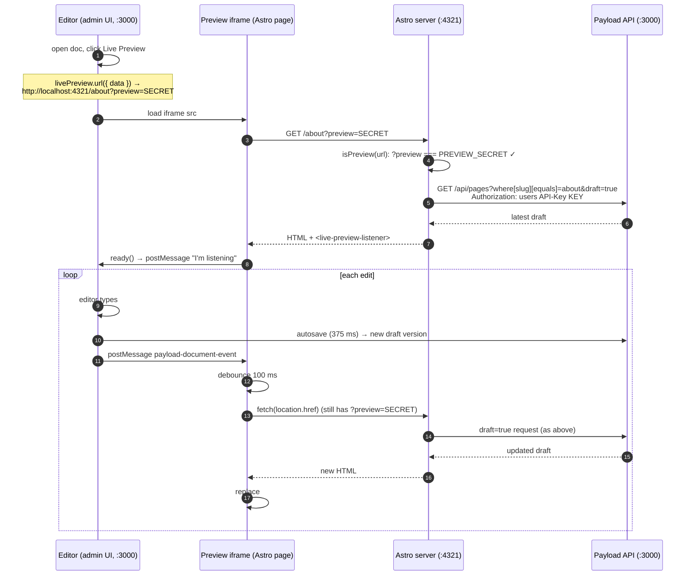

# 6. Live Preview

Live Preview lets an editor see the real website, with their **unsaved-to-the-public** changes, next to the edit form in the admin, updating as they type.

## What the editor sees

1. Open a Page or Watch in the admin (`localhost:3000/admin/collections/pages/1`).
2. Click **Live Preview**. A panel opens with the Astro page in an iframe, with Mobile, Tablet, and Desktop breakpoints.
3. Type in a field. About half a second later the preview updates. The public site is unchanged until they click **Publish**.

## How it works

Four mechanisms combine:

| Mechanism | Where |
| --- | --- |
| A **preview URL** with a shared secret | `apps/cms/src/utilities/previewURL.ts`, `admin.livePreview.url` on each collection |
| **Draft fetching** with an API key | `apps/web/src/lib/preview.ts`, `apps/web/src/lib/payload.ts` |
| **Autosave** that writes drafts | `versions.drafts.autosave` on Pages and Watches |
| A **listener** that re-renders on save | `apps/web/src/components/LivePreviewListener.astro` |



### Step by step

**1. The preview URL.** Each previewable collection says which Astro URL represents a document:

```ts
// Pages.ts
livePreview: { url: ({ data }) => previewURL(pagePath(data?.slug)) }   // home → '/', about → '/about'
// Watches.ts
livePreview: { url: ({ data }) => data?.slug ? previewURL(`/watches/${data.slug}`) : null }
// Header.ts / Footer.ts
livePreview: { url: () => previewURL('/') }
```

`previewURL(path)` returns `WEB_URL + path + '?preview=' + PREVIEW_SECRET`.

**2. Astro detects preview mode.**

```ts
// lib/preview.ts
export const isPreview = (url: URL) =>
  Boolean(PREVIEW_SECRET) && url.searchParams.get('preview') === PREVIEW_SECRET;
```

The secret stops random visitors from switching on preview mode by adding `?preview=1`.

**3. Astro fetches the draft.** With `draft: true`, the client adds `draft=true` and the preview user's API key. Payload authenticates the request as `preview@example.com`, so `publishedOrAuthenticated` lets drafts through, and `draft=true` returns the newest version instead of the published one.

**4. Autosave makes drafts exist.** Live Preview doesn't send form data to Astro. It relies on the document being **saved as a draft**. `autosave: { interval: 375 }` saves shortly after the editor stops typing. These saves go to the versions table. The public site keeps reading the main (published) document.

**5. The listener refreshes the page.** `Layout.astro` renders `<LivePreviewListener />` only in preview mode. Its browser script:

```ts
window.addEventListener('message', (event) => {
  if (!isDocumentEvent(event, serverURL)) return;   // only trust messages from the CMS origin
  clearTimeout(timeout);
  timeout = setTimeout(() => refresh(), 100);       // debounce bursts
});
ready({ serverURL });                                // tell the admin the iframe is listening
```

`refresh()` re-fetches the current URL, parses the HTML, and replaces `<div id="page">` with the new one. This avoids a full reload, so the scroll position stays. If `#page` isn't found, it falls back to `location.reload()`.

This is Payload's **server-side** Live Preview pattern: the server re-renders the page. (The alternative "client-side" pattern sends form data into a React app that re-renders in the browser. That doesn't suit Astro's server-rendered HTML.)

## Security notes

- The **API key** is only used server-side in Astro and never reaches the browser.
- The preview user can read drafts. Treat `PAYLOAD_API_KEY` as a secret, and in production give that user as little access as possible.
- Preview pages get `<meta name="robots" content="noindex">`.
- `PREVIEW_SECRET` is visible in the iframe URL to anyone using the admin. That's acceptable because they're editors anyway.

## Known behaviours

- **Clicking links inside the preview** drops `?preview=`, so the next page shows published content. This is expected.
- **Header and Footer** have no drafts. Their preview refreshes on **Save**, which also publishes them immediately.
- **Series** has no drafts and no `livePreview` URL, so it has no Live Preview. Edits are live as soon as they're saved.
- The **Preview** button (as opposed to Live Preview) opens the same preview URL in a new tab, without auto-refresh beyond what the listener receives.

## Debugging

Work through these in order. Also see `.claude/skills/debug-live-preview/SKILL.md`.

1. **Env parity**: `PREVIEW_SECRET` must match in both apps, and cms `PREVIEW_API_KEY` must equal web `PAYLOAD_API_KEY`. Restart both dev servers after changing `.env`. Re-run `npm run seed` if the key changed, because the seed assigns it to the preview user.
2. **Does the key work?**
   ```bash
   curl -g -H "Authorization: users API-Key $KEY" \
     'localhost:3000/api/pages?draft=true&where[slug][equals]=home&depth=0'
   ```
   A wrong key **doesn't error**. You just get published content.
3. **Draft only in preview**: after an autosave, `curl localhost:4321/` should **not** contain the change, and `curl "localhost:4321/?preview=$SECRET"` **should**.
4. **Listener present**: the preview HTML contains `<live-preview-listener data-server-url="http://localhost:3000">`. That origin must exactly match the admin's origin. `localhost` and `127.0.0.1` count as different origins.
5. **A new route doesn't update**: does every fetch on that page (including inside blocks) pass `{ draft: isPreview(Astro.url) }`? Does it render inside `Layout.astro`?
6. **Iframe blocked**: if a host adds `X-Frame-Options` or CSP `frame-ancestors` to the Astro site, allow the CMS origin.

Next: [Content model reference →](07-content-model.md)
