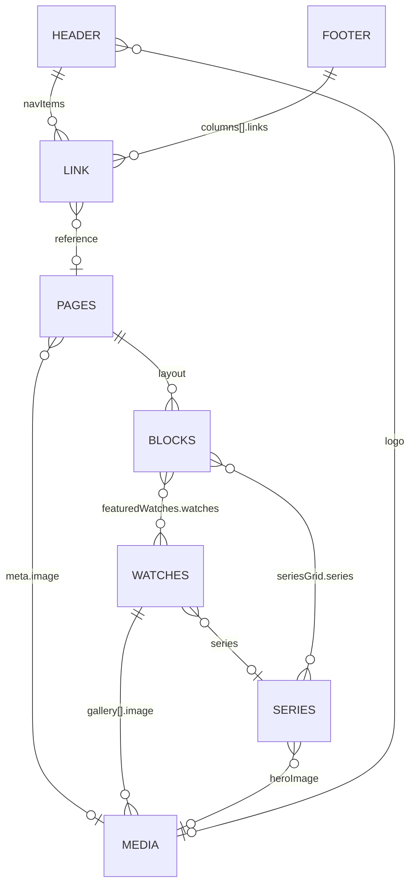

# 7. Content model reference

All content is defined in `apps/cms/src/`. The generated TypeScript interface name is shown in parentheses.

## Collections

### Pages (`Page`): `collections/Pages.ts`

The page builder. **Drafts + autosave.** Read: `publishedOrAuthenticated`.

| Field | Type | Notes |
| --- | --- | --- |
| `title` | text, required | |
| `slug` | text, unique | Auto from title. **`home` = homepage** |
| `layout` | blocks | Tab "Content". See [Blocks](#blocks) |
| `meta.title`, `meta.description`, `meta.image` | text, textarea, upload | Tab "SEO". Used by `Layout.astro` for `<title>`, description, and `og:image` |

Routes: `home` → `/`, anything else → `/<slug>` (`pages/index.astro`, `pages/[...slug].astro`).

### Watches (`Watch`): `collections/Watches.ts`

Products. **Drafts + autosave.** Read: `publishedOrAuthenticated`.

| Field | Type | Notes |
| --- | --- | --- |
| `name` | text, required | |
| `slug` | text, unique | Auto from name |
| `reference` | text | Sidebar. Reference number |
| `series` | relationship → series | Sidebar |
| `featured` | checkbox | Picked up by Featured watches blocks |
| `price` | number | Empty = "Price on request" (`formatPrice`) |
| `shortDescription` | textarea | Tab "Overview" |
| `description` | richText | Tab "Overview" |
| `gallery[].image` | array of upload | Tab "Overview". The first image is the card and OG image |
| `specs.movement` | select: automatic / manual / quartz | Tab "Specifications" |
| `specs.caliber`, `specs.caseMaterial`, `specs.strap` | text | |
| `specs.caseDiameterMm`, `specs.waterResistanceM`, `specs.powerReserveH` | number | |

Routes: `/watches` (list), `/watches/<slug>` (detail with the `WatchGallery` island).

### Series (`Series`): `collections/Series.ts`

Watch lines (Abyss, Lumière, Tempo). **No drafts.** Read: `anyone`.

| Field | Type |
| --- | --- |
| `name` | text, required |
| `slug` | text, unique |
| `tagline` | text |
| `description` | textarea |
| `heroImage` | upload |

Route: `/series/<slug>`, showing the series and its watches.

### Media (`Media`): `collections/Media.ts`

Image uploads. Read: `anyone`. Required `alt` text. Focal point enabled. Sizes: `thumbnail` 400×400, `card` 800×1000, `hero` 1920 wide. Files are stored in `apps/cms/media/`.

### Users (`User`): `collections/Users.ts`

Admin users. Auth with API keys enabled. Seeded users:

| Email | Purpose |
| --- | --- |
| `admin@example.com` / `changeme123` | Editor login. **Change before going live** |
| `preview@example.com` | Has the API key Astro uses to read drafts. Random password, not meant for login |

## Globals

### Header (`Header`): `globals/Header.ts`

| Field | Type |
| --- | --- |
| `logo` | upload (when empty, the site name is shown as text) |
| `navItems[].link` | array (max 8) of `linkField()` |

### Footer (`Footer`): `globals/Footer.ts`

| Field | Type |
| --- | --- |
| `columns[]` | array (max 4): `heading` + `links[].link` |
| `socialLinks[]` | `platform` (instagram, facebook, x, youtube, tiktok, linkedin) + `url` |
| `copyright` | text |

## Blocks

Registered in `apps/cms/src/blocks/index.ts`, rendered by `apps/web/src/components/blocks/<Name>.astro`.

| Block (slug) | Fields | Frontend behaviour |
| --- | --- | --- |
| **Hero** (`hero`) | eyebrow, heading*, subheading, image, cta[] (max 2 links) | Full-width image with text over it. First CTA styled primary, second secondary |
| **Rich text** (`richText`) | content* (richText) | Centered prose column |
| **Featured watches** (`featuredWatches`) | heading, intro, source (`featured` / `manual`), watches[] (if manual), limit (if featured, default 3) | `featured` fetches watches with `featured = true`. `manual` uses the picked ones |
| **Image with text** (`imageWithText`) | image*, imagePosition (left/right), heading, content (richText), enableLink, link | Two-column layout |
| **Series grid** (`seriesGrid`) | heading, series[] | Picked series, or **all** series if none are picked |
| **Call to action** (`callToAction`) | heading*, text, links[] (max 2) | Tinted box with buttons |
| **Gallery** (`gallery`) | heading, images[] (image*, caption) | Image grid |

\* required

## Reusable fields: `apps/cms/src/fields/`

- **`slugField(sourceField)`**: unique, indexed text field in the sidebar. If left empty, a `beforeValidate` hook fills it with `slugify(source)`. If filled in, it is slugified.
- **`linkField({ name?, label? })`**: group with `type` (`reference` | `custom`), `newTab`, `reference` (→ pages, shown when type is reference), `url` (shown when type is custom), `label` (required). Rendered by `<CMSLink>` and `linkHref()`.

## Website routes summary

| URL | Source | Data |
| --- | --- | --- |
| `/` | `pages/index.astro` | Page `home` |
| `/<slug>` | `pages/[...slug].astro` | Page `<slug>` (`/home` → 301 to `/`) |
| `/watches` | `pages/watches/index.astro` | All watches + all series |
| `/watches/<slug>` | `pages/watches/[slug].astro` | One watch |
| `/series/<slug>` | `pages/series/[slug].astro` | One series + its watches |
| anything missing | `pages/404.astro` | — |

Every page also loads the Header and Footer globals via `Layout.astro`.

Next: [Processes →](08-processes.md)
