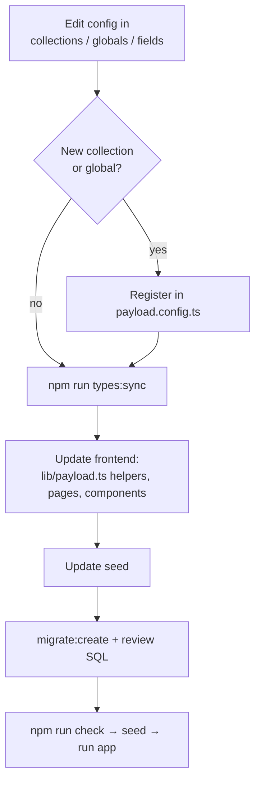

# 8. Processes (how-to)

Step-by-step procedures for common changes. Each section ends with a verification step.

- [Add a page-builder block](#add-a-page-builder-block)
- [Change the content model (collections, fields, globals)](#change-the-content-model)
- [Add a new page type / route](#add-a-new-route-for-a-collection)
- [Create and review a migration](#migrations)
- [Update the seed](#update-the-seed)
- [Change branding / styling](#change-branding-and-styling)
- [Add an interactive component](#add-an-interactive-component-react-island)
- [Reset the local database](#reset-the-local-database)
- [Before deploying](#before-deploying)

## Golden rules

1. After **any** schema change: `npm run types:sync`.
2. After **any** change: `npm run check`.
3. Every content fetch passes `{ draft: isPreview(Astro.url) }`.
4. Never edit `payload-types.ts` (either copy) or migrations that have already been applied.
5. Keep `npm run seed` working. It's the demo data.
6. Run `payload` CLI commands with `< /dev/null`.

---

## Add a page-builder block

A block lives in **two places that must stay in sync**. Example: a `testimonial` block.

**1. CMS config:** `apps/cms/src/blocks/Testimonial.ts`

```ts
import type { Block } from 'payload'

export const Testimonial: Block = {
  slug: 'testimonial',               // camelCase; becomes blockType
  interfaceName: 'TestimonialBlock', // generated TS interface name
  fields: [
    { name: 'quote', type: 'textarea', required: true },
    { name: 'author', type: 'text' },
    { name: 'image', type: 'upload', relationTo: 'media' },
  ],
}
```

Add it to `pageBlocks` in `apps/cms/src/blocks/index.ts`. Keep slugs short (Postgres's 63-character table-name limit). Reuse `linkField()` for links.

**2. Types:** `npm run types:sync`

**3. Astro component:** `apps/web/src/components/blocks/Testimonial.astro`

```astro
---
import type { TestimonialBlock } from '../../payload-types';
import Image from '../Image.astro';

type Props = TestimonialBlock;
const { quote, author, image } = Astro.props;
---
<section class="container-page py-16">
  <blockquote class="font-display text-2xl">{quote}</blockquote>
  {author && <p class="mt-4 text-accent">{author}</p>}
</section>
```

Use `<Image>`, `<RichText>`, `<CMSLink>`, and `populated()`. If the block fetches data, pass `draft: isPreview(Astro.url)`.

**4. Register it** in `apps/web/src/components/RenderBlocks.astro`: `testimonial: Testimonial` (the key = the slug).

**5. Seed:** add an example to the Home page in `apps/cms/src/seed/index.ts`.

**6. Migration:** `npm --prefix apps/cms run payload migrate:create add_testimonial_block < /dev/null`

**7. Verify:** `npm run check`, `npm run seed`, `npm run dev`. The block shows on `/`. In the admin, add it to a page, open Live Preview, and confirm it updates as you type.

---

## Change the content model

For adding or changing collections, globals, or fields.



1. **Edit the config.**
   - Access: public read + `authenticated` writes. Draft-enabled collections use `publishedOrAuthenticated` for read.
   - Documents with their own URL: add `slugField('<titleField>')`, plus `admin.livePreview.url` and `admin.preview` built with `previewURL()`.
   - Visual, editor-facing content: `versions: { drafts: { autosave: { interval: 375 } } }`.
   - New collections and globals go into `payload.config.ts`.
2. **`npm run types:sync`.** If you added custom admin React components, also run `npm --prefix apps/cms run generate:importmap`.
3. **Frontend.** Run `npm run check`. `astro check` lists every place that uses a renamed or removed field. Add fetch helpers to `lib/payload.ts` that accept `FetchOptions`.
4. **Seed.** Update it. It must stay idempotent: delete what it creates (by slug or filename) before recreating it.
5. **Migration.** See [Migrations](#migrations).
6. **Verify.** `npm run check`, `npm run seed`, then smoke-test.

> ⚠️ **Renaming or removing a field drops its data** in dev (schema push) and in the generated migration. If real content exists, migrate the data first, or ask before doing it.

---

## Add a new route for a collection

Example: a `/journal/<slug>` route for a new `posts` collection.

1. Create the collection (see above) with `slugField`, drafts, and `livePreview.url: ({ data }) => data?.slug ? previewURL(`/journal/${data.slug}`) : null`.
2. Add a helper to `apps/web/src/lib/payload.ts`:
   ```ts
   export const getPostBySlug = (slug: string, options?: FetchOptions) => findOne<Post>('posts', { slug }, options);
   ```
3. Create `apps/web/src/pages/journal/[slug].astro`:
   ```astro
   ---
   import Layout from '../../layouts/Layout.astro';
   import { getPostBySlug } from '../../lib/payload';
   import { isPreview } from '../../lib/preview';

   const post = await getPostBySlug(Astro.params.slug!, { draft: isPreview(Astro.url) });
   if (!post) return Astro.rewrite('/404');
   ---
   <Layout title={post.title}>…</Layout>
   ```
   Always render inside `Layout.astro`, which owns `#page` and the Live Preview listener.

---

## Migrations

Dev uses schema push, so you don't need migrations to work locally. You **do** need them for production.

```bash
npm --prefix apps/cms run payload migrate:create <descriptive_name> < /dev/null
```

This creates `apps/cms/src/migrations/<timestamp>_<name>.ts` (+ `.json` snapshot) and updates `migrations/index.ts`.

**Review the generated SQL** before committing. Look for `DROP COLUMN`, `DROP TABLE`, or `DROP TYPE`. These lose data. If a rename shows up as drop + add, edit the migration to use `ALTER TABLE … RENAME COLUMN` instead.

Production runs pending migrations on startup (`prodMigrations` in `payload.config.ts`). Other useful commands:

```bash
npm --prefix apps/cms run payload migrate:status < /dev/null
npm --prefix apps/cms run payload migrate < /dev/null        # apply manually
npm --prefix apps/cms run payload migrate:down < /dev/null   # roll back the last batch
```

Run these against a migrations-managed database, not the push-managed dev DB.

---

## Update the seed

`apps/cms/src/seed/index.ts` uses the Payload **Local API** (`payload.create`, `payload.update`, `payload.delete`, `payload.updateGlobal`).

- Delete first, then create, so re-runs don't duplicate or collide.
- Seeded images are named `seed-*`. The seed deletes them with `where: { filename: { like: 'seed-' } }`.
- Rich text: use the `lexical([...])` helper from `seed/lexical.ts`.
- Mark draft-enabled documents `_status: 'published'` so they appear on the site.

---

## Change branding and styling

All brand values live in `apps/web/src/styles/global.css` under `@theme`:

```css
@theme {
  --color-ink: …;  --color-paper: …;  --color-accent: …;
  --font-display: …;  --font-sans: …;
}
```

Change them there, and every `bg-ink`, `text-accent`, `font-display` etc. updates. To add a token, add `--color-gold: #…` and you can use `bg-gold` right away. Load web fonts in `Layout.astro`'s `<head>` and reference them in `--font-*`. The site name placeholder is `SITE_NAME` in `Layout.astro`.

---

## Add an interactive component (React island)

1. Write `apps/web/src/components/MyThing.tsx` (a regular React component).
2. Use it from an `.astro` file with a directive: `<MyThing client:visible prop={...} />`.
3. Pass plain, serialisable props. Convert Payload docs first (see how `watches/[slug].astro` builds `images` for `WatchGallery`).

Without a `client:*` directive, the component renders as static HTML only.

---

## Reset the local database

```bash
npm run db:down
docker volume rm astro-payload-pgdata     # ⚠️ deletes all local content
npm run db:up
# move stale seed-* files out of apps/cms/media first, so uploads don't collide
npm run dev:cms                           # first boot pushes the schema
npm run seed
```

Check `docker context show` says `desktop-linux` before running Docker commands.

---

## Debugging checklist

| Problem | Where to look |
| --- | --- |
| Page 500s | Is the CMS running? Check the `[web]` log for `Payload request failed: <status> <url>`. Try that URL with `curl -g` |
| Page 404s but the doc exists | Is it published? Is the slug correct? Anonymous requests only see `_status = published` |
| Block not rendering | Is it registered in `RenderBlocks.astro` with the exact slug? |
| Field is `undefined` in Astro | Did you run `types:sync`? Is it a relationship at too low a `depth` (you got an ID)? Use `populated()` |
| Image missing | `mediaUrl()` returns null if the media wasn't populated. Check the file exists in `apps/cms/media/` |
| Live Preview problems | [Live Preview: debugging](06-live-preview.md#debugging) |

Useful API pokes:

```bash
curl -s localhost:3000/api/pages?depth=0 | head -c 500
curl -sg 'localhost:3000/api/watches?where[featured][equals]=true&depth=0'
curl -s localhost:3000/api/globals/header?depth=1
```

---

## Before deploying

Not done yet. Track these before the first production deploy:

- [ ] Choose hosting for both apps. Keep the CMS and the database in the same region (Payload runs many sequential queries per request, so a distant DB makes everything slow).
- [ ] Use a **fresh production database** that is managed only by migrations.
- [ ] Add a storage adapter (S3, R2, Vercel Blob…) for Media. Local disk isn't persistent on most hosts.
- [ ] Set production env vars: new `PAYLOAD_SECRET`, `PREVIEW_SECRET`, API key, and real `WEB_URL`, `PAYLOAD_PUBLIC_SERVER_URL`, `PAYLOAD_URL`.
- [ ] Remove or change the seeded admin password. Don't run the seed against production unless you intend to.
- [ ] Configure an email adapter (password resets).
- [ ] Consider caching on the Astro side (`Cache-Control` headers or a CDN), plus a Payload `afterChange` hook to purge on publish.
- [ ] `npm run check && npm run build` passes.
